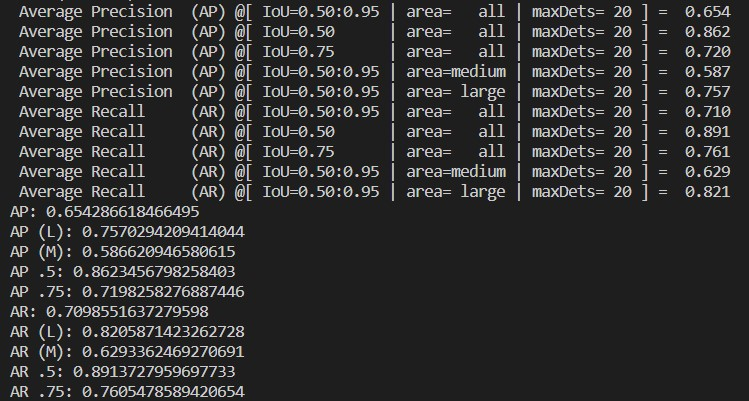

# 基于mmpose的HRNet模型在Ascend310上部署测试
## 基础环境
x86服务器+Atlas300I-3010加速卡+ubuntu20.04 LTS+docker20.10.7，已安装加速卡驱动固件[npu-driver22.0.3，npu-firmware1.83.10.1.248](https://www.hiascend.com/zh/hardware/firmware-drivers/community)。
## 参数脚本
[higherhrnet_w32_coco_512x512.py](https://github.com/open-mmlab/mmpose/blob/master/configs/body/2d_kpt_sview_rgb_img/associative_embedding/coco/higherhrnet_w32_coco_512x512.py)。
## 代码仓下载
```bash
cd /path/to/hrnet
git clone https://github.com/AspartameJ/mmpose.git
cd mmpose
```
## 模型下载
```bash
wget https://download.openmmlab.com/mmpose/bottom_up/hrnet_w32_coco_512x512-bcb8c247_20200816.pth
```
## 数据集下载
[coco val2017 images and person_keypoints_val2017.json](https://cocodataset.org/#download)。
```
mmpose
  |
  data
    |-- coco
    `-- |-- annotations
        |   |-- person_keypoints_val2017.json
        `-- val2017
            |-- 000000000139.jpg
            |-- 000000000285.jpg
            |-- 000000000632.jpg
            |-- ...
```
## docker镜像下载
[ascendhub.huawei.com/public-ascendhub/pytorch-modelzoo:22.0.RC3-1.8.1](https://ascendhub.huawei.com/public-ascendhub/pytorch-modelzoo:22.0.RC3-1.8.1#/detail/pytorch-modelzoo)。
## 容器启动
```bash
docker run -it -u root --name torch_npu --ipc=host \
--device=/dev/davinci0 \
--device=/dev/davinci_manager \
--device=/dev/devmm_svm \
--device=/dev/hisi_hdc \
-v /usr/local/Ascend/driver:/usr/local/Ascend/driver \
-v /usr/local/Ascend/add-ons/:/usr/local/Ascend/add-ons/ \
-v /var/log/npu/conf/slog/slog.conf:/var/log/npu/conf/slog/slog.conf \
-v /var/log/npu/slog/:/var/log/npu/slog \
-v /var/log/npu/profiling/:/var/log/npu/profiling \
-v /var/log/npu/dump/:/var/log/npu/dump \
-v /var/log/npu/:/usr/slog \
-v /usr/local/sbin/npu-smi:/usr/local/sbin/npu-smi \
-v /etc/ascend_install.info:/etc/ascend_install.info \
-v /path/to/hrnet:/root/hrnet \
ascendhub.huawei.com/public-ascendhub/pytorch-modelzoo:22.0.RC3-1.8.1 \
bash
```
## 容器内操作
安装[ascend-cann-toolkit](https://www.hiascend.com/software/cann/community)，注意版本与驱动固件匹配。<br>
安装[ais_bench](https://gitee.com/ascend/tools/tree/master/ais-bench_workload/tool/ais_bench)模型推理工具。<br>
```bash
# dstat sysstat安装
root@2e9162c9611b:~/hrnet/mmpose# apt update
root@2e9162c9611b:~/hrnet/mmpose# apt install dstat sysstat
# mmcv安装
root@2e9162c9611b:~/hrnet/mmpose# pip install mmcv-full -f https://download.openmmlab.com/mmcv/dist/ascend/torch1.8.0/index.html

# mmpose代码克隆
root@2e9162c9611b:~/hrnet/mmpose# git clone https://github.com/AspartameJ/mmpose.git

# mmpose依赖安装
root@2e9162c9611b:~/hrnet/mmpose# pip install torchvision==0.9.1 onnx onnxruntime onnx-simplifier xtcocotools json_tricks munkres

# pth转onnx
root@2e9162c9611b:~/hrnet/mmpose# python3 tools/deployment/pytorch2onnx.py ./configs/body/2d_kpt_sview_rgb_img/associative_embedding/coco/hrnet_w32_coco_512x512.py ./hrnet_w32_coco_512x512-bcb8c247_20200816.pth --verify --output-file dynamic_hrnet.onnx --opset-version 11 --test-dynamic

# 模型简化
root@2e9162c9611b:~/hrnet/mmpose# python3 remove_initializer_from_input.py --input dynamic_hrnet.onnx --output dynamic_hrnet_remove_initializer_from_input.onnx

root@2e9162c9611b:~/hrnet/mmpose# python3 ./onnx2onnxsim.py --input ./dynamic_hrnet_remove_initializer_from_input.onnx --output ./dynamic_hrnet_sim.onnx

# onnx转om
root@2e9162c9611b:~/hrnet/mmpose# bs=1
root@2e9162c9611b:~/hrnet/mmpose# chip_name=Ascend310
root@2e9162c9611b:~/hrnet/mmpose# atc --framework=5 --model=dynamic_hrnet_sim.onnx --output=dynamic_hrnet --input_format=ND --input_shape="input:${bs},3,-1,-1" --dynamic_dims="512,832;512,768;576,512;512,704;832,512;512,960;512,1024;704,512;512,640;768,512;512,896;512,512;896,512;512,576;512,1152;512,1088;960,512;640,512;512,1920;512,1344;512,1728;512,2048;512,1280;1024,512;512,1792;1152,512;512,1984;512,2112;512,1472;512,1216;512,1536;512,1408;1344,512;1088,512;512,1856;512,1600" --soc_version=${chip_name}

# 一键推理
root@2e9162c9611b:~/hrnet/mmpose# bash infer_start.sh
```
~~### 数据预处理
root@2e9162c9611b:~/hrnet/mmpose# python3 hrnet_preprocess.py configs/body/2d_kpt_sview_rgb_img/associative_embedding/coco/hrnet_w32_coco_512x512.py hrnet_w32_coco_512x512-bcb8c247_20200816.pth --img-path data/coco/val2017~~

~~### 模型推理
root@2e9162c9611b:~/hrnet/mmpose# mkdir output_dir output_flip_dir
root@2e9162c9611b:~/hrnet/mmpose# python3 -m ais_bench --model dynamic_hrnet.om --input ./resized_imgs --output output_dir --output_dirname resized_img_result --outfmt NPY --auto_set_dymdims_mode 1
root@2e9162c9611b:~/hrnet/mmpose# python3 -m ais_bench --model dynamic_hrnet.om --input ./fliped_imgs --output output_flip_dir --output_dirname flip_img_result --outfmt NPY --auto_set_dymdims_mode 1~~

~~### 模型后处理(包括精度计算)
root@2e9162c9611b:~/hrnet/mmpose# mkdir om_work_dir
root@2e9162c9611b:~/hrnet/mmpose# python3 hrnet_postprocess.py configs/body/2d_kpt_sview_rgb_img/associative_embedding/coco/hrnet_w32_coco_512x512.py hrnet_w32_coco_512x512-bcb8c247_20200816.pth --img-path ./data/coco/val2017 --resized-img-result ./output_dir/resized_img_result --fliped-img-result ./output_flip_dir/flip_img_result --out om_eval_result.json --work-dir ./om_work_dir --eval mAP~~


## 精度结果

